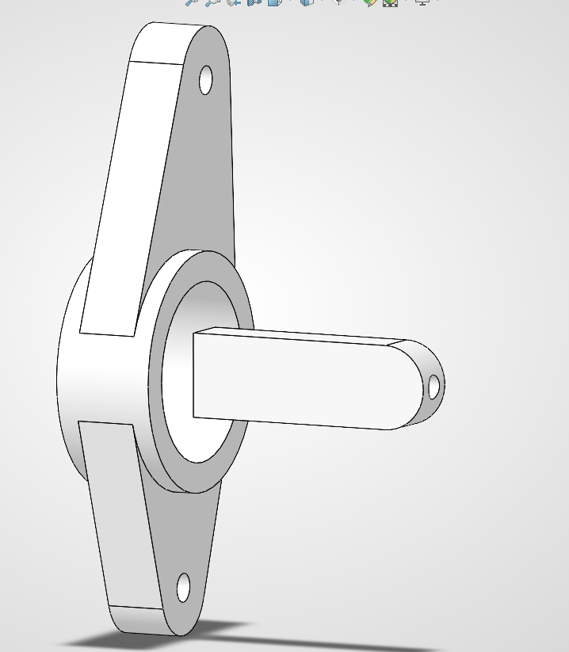
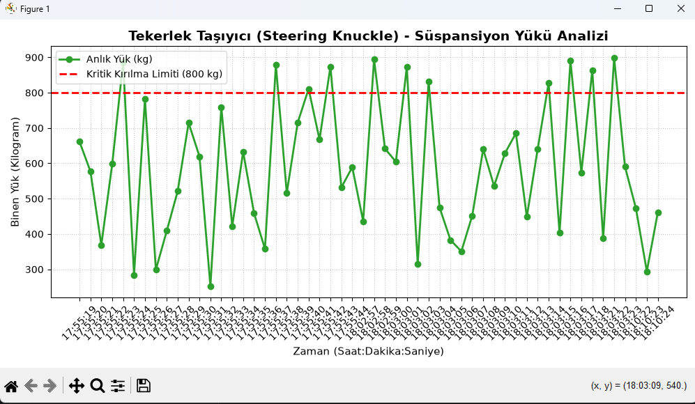

# 🏎️ Steering Knuckle CAD & Telemetry Data Simulation

This project combines **Mechanical Design** and **Software Engineering (Mechatronics)**. It features the complete 3D solid modeling of an automotive steering knuckle and a Python-based virtual telemetry system to simulate and analyze dynamic suspension loads.

## 🛠️ Technologies Used
* **CAD Software:** SolidWorks (3D Modeling, Extruded Cuts, Parametric Design)
* **Programming Language:** Python 3.x
* **Data Visualization:** Matplotlib
* **Data Logging:** Real-time `.txt` logging (Blackbox mechanism)

## ⚙️ Mechanical Design
The steering knuckle was designed with critical engineering tolerances, including a fully cleared 75mm central hub tunnel for the axle shaft and a structurally reinforced steering tie-rod arm.



## 💻 Telemetry Simulation & Analysis
The Python simulation generates real-time data for:
1. Vehicle Speed (km/h)
2. Steering Angle (Degrees)
3. Dynamic Suspension Load (kg)

The system includes a **Critical Load Warning** triggered at 800 kg to simulate severe impacts (e.g., potholes). The logged data is then visualized using Matplotlib to analyze structural stress over time.



## 🚀 How to Run the Simulation
1. Clone this repository.
2. Install the required visualization library:
   ```bash
   pip install matplotlib

## 👨‍💻 Developer
Ege Zabun - Mechanical Engineering Student
